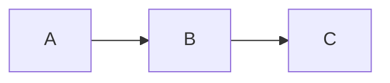

# Case Study: <Human Title>

> A production narrative from **<Fictional Company>**. The scars, the decision, the numbers.

## Business context

<Who they are, what they do, why the problem showed up. Named company, plausible domain.>

## Scale

| Metric | Value |
|---|---|
| Users / tenants | <…> |
| Peak throughput | <… rps> |
| Data volume | <… GB/day> |
| Latency SLO | <… ms p99> |

## The decision

<The fork in the road. Options considered, constraints, what they optimized for.>

## Architecture



## Design / schema

```sql
-- or ts / json — the concrete design
```

## Implementation

<The interesting parts of how it was built. Real code, real structure.>

## Performance

<Before/after numbers. What moved. A table or two.>

## Production lessons

- **What broke:** <the incident.>
- **What they'd do differently:** <honest hindsight.>
- **The transferable principle:** <what the reader takes to their own system.>
