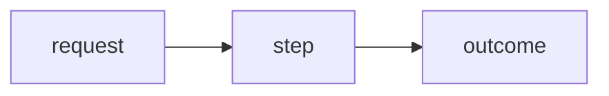

# <NN> — <Human Title>

> **Goal:** <one sentence — what the reader can DO after this chapter.>

<One-paragraph hook: a concrete, named scenario with real scale that makes this matter. Stakes first.>

---

## The problem

<The business/engineering problem, grounded in the scenario above. Numbers, not adjectives.>

## Mental model

<How to THINK about this — the part readers quote back. At least one diagram.>



## How it works

<Core mechanics, built in stages. Each stage runnable/annotated. Link to src/** where relevant.>

```ts
// concrete, runnable, annotated — no hand-waving
```

## What happens internally

<System-level execution path. Why it behaves as it does.>

## Production tradeoffs

<Latency, cost, ops burden, blast radius, failure modes. What a Staff Engineer weighs.>

## When NOT to use this

<Honest boundaries. The reader should know the failure cases.>

## Anti-patterns

- **<Named anti-pattern>** — what it looks like → why it fails → what to do instead.
- **<Named anti-pattern>** — … .
- **<Named anti-pattern>** — … .

## Worked example

<A spec, then a FULL worked solution (premium) or a concrete runnable example (free). No stubs.>

## Top takeaways

1. …
2. …
3. …
4. …
5. …

## Revision questions

1. …
2. …
3. …

## Next

- [<Human Title>](<other-contentKey>)
- [<Human Title>](<another-contentKey>)
