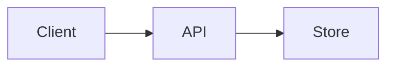

# Lab: <Human Title>

> **You will build:** <the concrete artifact — a working X that does Y at Z scale.>
> **Time:** <N hours.>  **Prereqs:** <chapters/contentKeys.>

## Objective

<What "done" looks like, as an observable outcome.>

## Business context

<Named (fictional) company + concrete scale. The reason this lab exists.>

## Architecture



<Short description of the pieces and why.>

## Implementation

### Step 1 — Model the domain
```ts
// types / schema
```

### Step 2 — Core logic
```ts
// the heart of the lab
```

### Step 3 — Advanced (scale / failure / edge cases)
```ts
// what makes it staff-level
```

## Performance analysis

<Real numbers: complexity, latency, memory, QPS. A small table.>

## Common mistakes

- **<Named>** — … .
- **<Named>** — … .

## Tradeoffs

<What you gave up; when a different approach wins.>

## Staff Engineer discussion

<The design-review conversation: alternatives, scaling limits, what breaks first.>

## Complete solution

<The FULL, runnable solution — every step assembled. This section is mandatory and must not be a
stub. A reader could paste this and run it.>

```ts
// complete, self-contained solution
```
