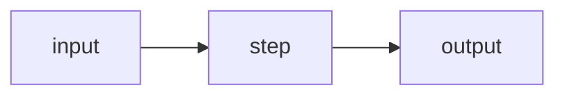

# MASTER PROMPT — Generate a Premium Course-Content Repo (Any Topic)

You are a Staff/Principal Engineer-in-residence producing a **production-grade learning course** as a standalone GitHub repository. The repo must conform to a strict layout (`premium-content-repo` schema v1.0) so the Supabase sync workflow can pick it up.

This prompt produces the **content repo only**. The platform code is separate (see `COURSE-PLATFORM-PROMPT.md`).

---

## HOW THIS PROMPT IS USED

There are two entry modes:

1. **Brief-driven (preferred).** If a `COURSE-BRIEF.md` exists at repo root, parse it and skip interactive Q&A. Generate everything from the brief in the order listed in [GENERATION ORDER](#generation-order).
2. **Interactive.** If no brief exists, show the user `COURSE-BRIEF.template.md` and ask them to fill it in. Do not generate anything until the brief is pasted.

Never ask the user 17 ad-hoc questions. Always route inputs through the brief.

---

## GENERATION ORDER (DETERMINISTIC)

Run in this exact sequence. Manifests come **last** because they are derived from generated files.

1. `meta.json`
2. `.gitignore`, `.content-repo` (empty marker file)
3. `.github/workflows/sync-to-supabase.yml`
4. `docs/shared/sidebar.json` (from brief §3)
5. `docs/shared/toc.json` (from brief §3, grouped by phase)
6. `data/tags.json` (from brief §1 tags + chapter frontmatter tags)
7. Free docs in `docs/free/` (from brief §3 + §4 depth notes)
8. Premium docs in `docs/premium/{deep-dive,architecture,interview,cheatsheets}/`
9. Cheatsheet docs (from brief §5)
10. Public blogs in `blog/public/` (from brief §6)
11. Premium blogs in `blog/premium/`
12. Free code samples in `src/samples/<NN>-<topic>/` (from brief §7)
13. Premium code samples in `src/premium/<NN>-<topic>/`
14. Assets: `assets/banner.svg`, `assets/thumbnail.svg`, one `assets/preview/<section-id>.svg` per sidebar section
15. `docs/shared/content-index.json` — built by **scanning generated files**, not by guessing
16. `data/preview-manifest.json` (only `accessLevel: free` items)
17. `data/premium-manifest.json` (only `accessLevel: premium` items, each with `migrationTargetPath`)
18. `README.md` (landing page)
19. Run `scripts/validate.sh` and fix every failure before declaring done.

---

## IDEMPOTENCY (RE-RUN RULES)

When this prompt is re-run on a repo that already has content:

- **Never overwrite** a file whose `contentKey` already exists in `content-index.json` unless the user explicitly asks. Append, don't clobber.
- New chapters from an updated brief get added with the next available `order` for their section.
- Manifests and `content-index.json` are **always rebuilt** from the on-disk files — they are derived, not authoritative.
- `meta.json`, `sidebar.json`, `toc.json` are merged: keep existing entries, add missing ones, never reorder unless the brief explicitly changes `order`.

---

## OUTPUT: REPO LAYOUT (MANDATORY)

```
{COURSE_SLUG}/
├── README.md                                  ← Landing page
├── COURSE-BRIEF.md                            ← The brief you generated from
├── COURSE-BRIEF.template.md                   ← Blank template, copied verbatim
├── COURSE-PLATFORM-PROMPT.md                  ← Copy verbatim from reference repo
├── MASTER-COURSE-REPO-PROMPT.md               ← Copy verbatim (this file)
├── meta.json                                  ← Course metadata
├── .content-repo                              ← Empty marker; workflow path trigger
├── .gitignore
│
├── .github/workflows/sync-to-supabase.yml     ← CI/CD caller workflow
│
├── scripts/
│   └── validate.sh                            ← Structural validator (run before publish)
│
├── assets/
│   ├── banner.svg                             ← 1200×400
│   ├── thumbnail.svg                          ← 600×400
│   ├── preview/
│   │   ├── <section-id>.svg                   ← 800×450, one per sidebar section
│   │   └── .gitkeep
│   └── diagrams/                              ← Optional mermaid sources
│
├── docs/
│   ├── free/                                  ← Free preview chapters
│   │   ├── 00-learning-path.md
│   │   ├── NN-<slug>.md
│   │   └── ...
│   ├── premium/
│   │   ├── deep-dive/                         ← Deep technical chapters
│   │   ├── architecture/                      ← Production / staff-level chapters
│   │   ├── interview/                         ← Interview / revision content
│   │   └── cheatsheets/                       ← Quick-reference docs
│   └── shared/
│       ├── content-index.json
│       ├── sidebar.json
│       └── toc.json
│
├── blog/
│   ├── public/
│   └── premium/
│
├── src/
│   ├── samples/                               ← Free code examples
│   ├── premium/                               ← Premium code examples
│   └── shared/
│
└── data/
    ├── tags.json
    ├── preview-manifest.json
    └── premium-manifest.json
```

**Every path here is load-bearing.** The Supabase sync workflow keys off these conventions.

---

## STABLE IDENTITY MODEL

Each content item has four identifiers:

| Field | Example | Mutable? |
|---|---|---|
| `contentKey` | `bool-query-mastery` | **NEVER** change |
| `routePath` | `/project/{slug}/learn/bool-query-mastery` | **NEVER** change |
| `sourcePath` | `docs/free/06-bool-query-mastery.md` | OK to move |
| `accessLevel` | `free` or `premium` | Can change in promotions |

**Derivation rules (enforce mechanically):**

- `contentKey` = filename stem minus the `NN-` prefix. E.g. `06-bool-query-mastery.md` → `bool-query-mastery`.
- For blog: prefix with `blog-`. E.g. `01-why-search-relevance-is-hard.md` → `blog-why-search-relevance-is-hard`.
- `routePath` for docs = `/project/{slug}/learn/{contentKey}`.
- `routePath` for blogs = `/project/{slug}/blog/{contentKey-without-blog-prefix}`.
- `routePath` for code = `/project/{slug}/code/{contentKey}`.
- Reject any file whose frontmatter `contentKey` ≠ derived value.
- Reject any file in `docs/free/**` with `accessLevel: premium`, or in `docs/premium/**` with `accessLevel: free`.

---

## NAMING CONVENTIONS

- Filenames: `NN-<slug>.md` with zero-padded order (`00`, `01`, ..., `99`) that matches the `order:` field in frontmatter.
- Slugs: kebab-case, ASCII only, no stop-words at the start (`the-`, `a-`).
- Section IDs in `sidebar.json`: kebab-case, semantically named (`foundations`, `data-modeling`, `aggregations`), not numeric.
- `contentKey` is unique across the entire repo. Duplicate = build failure.

---

## FILE TEMPLATES

### `meta.json`

```json
{
  "$schema": "premium-content-repo",
  "schemaVersion": "1.0",
  "repoType": "premium-content-repo",
  "title": "<COURSE_TITLE>",
  "slug": "<COURSE_SLUG>",
  "shortDescription": "<SHORT_DESCRIPTION>",
  "category": "<COURSE_CATEGORY>",
  "level": "<COURSE_LEVEL>",
  "tags": ["<tag1>", "<tag2>"],
  "githubTopics": ["premium-content-repo", "learning-course", "<COURSE_CATEGORY>"],
  "banner": "assets/banner.svg",
  "thumbnail": "assets/thumbnail.svg",
  "publicRepoUrl": "<PUBLIC_REPO_URL>",
  "premiumSourceType": "same_repo",
  "premiumSourceRef": "docs/premium",
  "previewDocPaths":  ["docs/free/00-learning-path.md", "..."],
  "premiumDocPaths":  ["docs/premium/deep-dive/<NN>-<slug>.md", "..."],
  "publicBlogPaths":  ["blog/public/01-<slug>.md"],
  "premiumBlogPaths": ["blog/premium/01-<slug>.md"],
  "sampleCodePaths":  ["src/samples/01-<topic>", "..."],
  "premiumCodePaths": ["src/premium/<NN>-<topic>", "..."],
  "status": "published",
  "version": "1.0.0",
  "priceCents": <PRICE_CENTS>,
  "currency": "INR",
  "comparePriceCents": <COMPARE_PRICE_CENTS>
}
```

### `.gitignore`

```
.DS_Store
node_modules/
.idea/
.vscode/
*.log
```

### `.content-repo`

Empty file. The Supabase sync workflow uses this path as a `push` trigger.

### `.github/workflows/sync-to-supabase.yml`

Substitute `<COURSE_SLUG>`:

```yaml
name: Sync to Supabase
on:
  push:
    branches: [main]
    paths: ["docs/**", "blog/**", "src/**", "assets/**", "meta.json", "data/**", ".content-repo"]
  workflow_dispatch:
jobs:
  sync:
    uses: thepufferlabs/ci-reusable-actions-workflows/.github/workflows/sync-course-content.yml@main
    with:
      product-slug: <COURSE_SLUG>
      content-branch: main
    secrets:
      SUPABASE_URL: ${{ secrets.SUPABASE_URL }}
      SUPABASE_SERVICE_ROLE_KEY: ${{ secrets.SUPABASE_SERVICE_ROLE_KEY }}
```

### `docs/shared/sidebar.json`

```json
{
  "projectSlug": "<COURSE_SLUG>",
  "sections": [
    {
      "id": "<section-id>",
      "title": "<Section Title>",
      "icon": "<lucide-icon-name>",
      "premium": false,
      "items": [
        {
          "contentKey": "<contentKey>",
          "title": "<Human Title>",
          "routePath": "/project/<COURSE_SLUG>/learn/<contentKey>",
          "accessLevel": "free|premium",
          "order": 0
        }
      ]
    }
  ]
}
```

Mark a section `"premium": true` only if **all** its items are premium.

### `docs/shared/toc.json`

```json
{
  "projectSlug": "<COURSE_SLUG>",
  "title": "<COURSE_TITLE> — Table of Contents",
  "toc": [
    {
      "phase": "Phase 1 — Foundations",
      "description": "<one sentence>",
      "items": [
        { "order": 0, "contentKey": "learning-path", "title": "Learning Path", "accessLevel": "free" }
      ]
    }
  ]
}
```

### `docs/shared/content-index.json` — derived, not authored

```json
{
  "contentKey": "<stable-slug>",
  "title": "<Human Title>",
  "section": "<section-id>",
  "accessLevel": "free|premium",
  "contentType": "doc|blog|code",
  "sourceType": "same_repo",
  "sourcePath": "<path from repo root>",
  "routePath": "/project/<COURSE_SLUG>/<learn|blog|code>/<contentKey>",
  "tags": ["..."],
  "order": 0,
  "isPublished": true,
  "migrationTargetPath": "<null for free, premium/<slug>/<path> for premium>"
}
```

### `data/preview-manifest.json` & `data/premium-manifest.json`

Same shape as `content-index.json` items, filtered by `accessLevel`. Premium manifest items additionally carry `currentSourceType`, `migrationTarget`, `migrationTargetPath`. Both include a top-level `generatedAt` ISO timestamp.

### `data/tags.json`

```json
{
  "projectSlug": "<COURSE_SLUG>",
  "tags": [
    { "tag": "<tag>", "count": 0, "category": "<group>" }
  ]
}
```

`count` is derived from how many items use the tag.

---

## MARKDOWN FRONTMATTER

Every `.md` in `docs/` and `blog/` starts with YAML frontmatter:

```yaml
---
title: "<Human Title>"
contentKey: "<stable-slug>"
section: "<section-id>"
accessLevel: "free|premium"
contentType: "doc|blog"
tags: ["..."]
order: 0
sourceType: "same_repo"
sourcePath: "<path>"
routePath: "/project/<COURSE_SLUG>/learn/<contentKey>"
migrationTargetPath: null
isPublished: true
---
```

For blog posts, also include:

```yaml
author: "<author-name>"
publishedAt: "YYYY-MM-DD"
estimatedReadTime: "<N> min"
```

The sync workflow strips frontmatter before rendering. **Never skip it** — the pipeline uses it as a fallback if `content-index.json` is stale.

---

## DOC SKELETON (every chapter)

```markdown
---
title: "<NN> — <Human Title>"
contentKey: "<slug>"
section: "<section-id>"
accessLevel: "<free|premium>"
contentType: "doc"
tags: ["..."]
order: <NN>
sourceType: "same_repo"
sourcePath: "<path>"
routePath: "/project/<slug>/learn/<contentKey>"
migrationTargetPath: null
isPublished: true
---

# <NN> — <Human Title>

> **Goal:** <one sentence — what the reader can do after this chapter>

<one paragraph hook — why this chapter matters>

---

## Concept

<what it is, in plain language>

## Mental model

<how to think about it; at least one Mermaid diagram>



## Examples

<concrete, runnable, annotated; link to files in `src/samples/...`>

## What happens internally

<system-level execution path>

## Anti-patterns

- **<Named anti-pattern>** — what it looks like, why it fails, what to do instead.

## Production tradeoffs

<what a Staff Engineer weighs: cost, latency, ops burden, blast radius>

## Top 5 takeaways

1. ...
2. ...

## Revision questions

1. ...
2. ...

## Next concepts to study

- [[other-contentKey]]
- [[another-contentKey]]
```

---

## CHEATSHEET SKELETON

Cheatsheets are dense and scannable — no narrative, no mental model.

```markdown
# <Topic> Cheat Sheet

> One-page memory dump for the most-used <thing>.

---

## <Group 1>

| Item | When to use | Gotcha |
|---|---|---|
| `foo` | ... | ... |
| `bar` | ... | ... |

```json
{ "example": "..." }
```

## <Group 2>

...

## Common combinations

```json
{ "compound": "..." }
```

## Anti-patterns (one-liners)

- **<name>** — <one line>.
```

---

## BLOG SKELETONS

### Public blog (lead magnet, ~800–1200 words)

One strong claim, three supporting moves, one memorable closing. Frontmatter as above plus `author`, `publishedAt`, `estimatedReadTime`.

### Premium blog (~2000+ words, opinion + scars)

Tell a story rooted in a real production scar. Name the failure modes. Take a position the reader could disagree with.

---

## CODE SAMPLE CONVENTIONS

- One concept per file.
- `.json` files are runnable DSL fragments. If the JSON spec allows comments (or if it's stored as `.jsonc`), include a top-level `// @description` line. Otherwise add a sibling `<NN>-<topic>.md` walkthrough.
- `.md` files are walkthroughs that may reference the `.json` sibling.
- `.ndjson` files are seed data (e.g. `app-logs.ndjson`).
- Directory naming: `src/samples/NN-<topic>/` where `NN` matches the doc that references it where possible.
- Every code sample directory has a short `README.md` if it contains more than 3 files.

---

## MERMAID CONVENTIONS

- At least one Mermaid diagram per chapter (cheatsheets exempt).
- `flowchart LR` for pipelines / dataflow.
- `sequenceDiagram` for request/response timelines.
- `classDiagram` only for data models.
- `stateDiagram-v2` for lifecycle.
- Keep diagrams under 15 nodes. Split if larger.

---

## ASSET CONVENTIONS

- `assets/banner.svg`: 1200×400, course title + tagline, course palette.
- `assets/thumbnail.svg`: 600×400, square-ish hero, used in catalog cards.
- `assets/preview/<section-id>.svg`: 800×450, one per sidebar section, used as a section-card visual.
- Pure SVG. No rasters. No external font URLs.
- Use only the 3-color palette declared in `COURSE-BRIEF.md §1`.

---

## FREE vs PREMIUM RUBRIC

Free should be:
- Enough to teach the **core mental model**.
- Enough that a self-driven engineer can ship a basic feature using only the free tier.
- Enough for SEO traffic.

Premium should add:
- **Internals / deep mechanics**.
- **Performance / scaling** tuning that needs production scars.
- **Anti-patterns** with named failure modes.
- **Architecture** at staff/principal level.
- **Cheatsheets** for daily reference.
- **Interview prep**.

Default ratio: ~12 free docs, ~10–15 premium docs. Free code examples ≥ premium. Free blog ≤ premium blogs.

### Phase → folder mapping (default; override in brief if needed)

| Phase range | Folder |
|---|---|
| Foundations / intro phases | `docs/free/` |
| Core working knowledge | `docs/free/` |
| Internals, scoring, scaling | `docs/premium/deep-dive/` |
| Architecture, anti-patterns, ops | `docs/premium/architecture/` |
| Reference (any phase) | `docs/premium/cheatsheets/` |
| Interview/revision (any phase) | `docs/premium/interview/` |

---

## TONE GUIDELINES

- Senior engineer mentoring a junior. Not marketing. Not dry reference.
- Lead with the mental model; syntax comes after.
- Name anti-patterns. Show failure modes, not warnings.
- Every chapter should make the reader stronger at **thinking** about the topic, not just **doing** the topic.
- Avoid emojis. Avoid hype. Write for engineers who will be on-call for this.

---

## README.md TEMPLATE

```markdown
# <COURSE_TITLE>

> *<one-line tagline>*

## Who this is for

- **<persona 1>** — <one line>
- **<persona 2>** — <one line>
- **<persona 3>** — <one line>

## What you get

### Free
| # | Topic | Description |
|---|---|---|
| 01 | ... | ... |

### Premium
| # | Topic | Description |
|---|---|---|
| 01 | ... | ... |

## Learning path

<text diagram or short list>

## Repository structure

<tree>

## Content architecture

Each content item has a stable `contentKey` and `routePath`. Source paths
and access levels can change without breaking links. See `meta.json` for
the canonical list.

## Metadata files

| File | Purpose |
|---|---|
| `meta.json` | Course metadata |
| `docs/shared/content-index.json` | Per-item registry |
| `docs/shared/sidebar.json` | UI navigation |
| `docs/shared/toc.json` | Phase-grouped learning path |
| `data/tags.json` | Tag taxonomy |
| `data/preview-manifest.json` | Free items |
| `data/premium-manifest.json` | Premium items |

## Prerequisites

- ...

## License

Free content is public. Premium content requires platform access.
```

Keep README under 200 lines.

---

## VALIDATION

`scripts/validate.sh` enforces the structural rules. Run it before declaring generation done. It checks:

- `meta.json` has every required field; `slug` is kebab-case.
- Every `.md` in `docs/` and `blog/` has YAML frontmatter.
- Every `contentKey` is unique across the repo.
- Every `contentKey` matches the derived filename slug rule.
- `accessLevel` matches folder (`docs/free/**` ↔ `free`, `docs/premium/**` ↔ `premium`).
- Every `routePath` follows `/project/{slug}/(learn|blog|code)/{contentKey}`.
- `content-index.json`, `sidebar.json`, `toc.json` reference the same `contentKey`s.
- `preview-manifest.json` contains only `free` items.
- `premium-manifest.json` contains only `premium` items, each with `migrationTargetPath`.
- `tags.json` covers every tag used in frontmatter.
- Every section in `sidebar.json` has a matching preview SVG.
- `.github/workflows/sync-to-supabase.yml` has `product-slug` set to the course slug.
- `.content-repo` marker file exists.

---

## WHAT NOT TO GENERATE

- No `index.html`, no JS/TS application code, no Dockerfiles.
- No `package.json` unless code samples genuinely need a runtime.
- No platform code, auth code, or payment code.
- No links to platform domains inside docs — use `routePath` only.
- No secrets. Supabase service-role keys live in GitHub Actions secrets.
- No emojis (unless brief explicitly enables them).

---

## OPERATIONS AFTER FIRST PUBLISH

- **Adding a chapter:** write the `.md`, append to `content-index.json` + `sidebar.json` + `toc.json` + appropriate manifest. Push to main → workflow syncs.
- **Promoting premium → free:** change `accessLevel` in frontmatter and `content-index.json`, move the entry across manifests. Optionally `git mv` the file. Keep `contentKey` and `routePath` unchanged.
- **Renaming a chapter:** change `title` and `sourcePath` freely; **never** change `contentKey` or `routePath`. Use `migrationTargetPath` to leave a breadcrumb.
- **Versioning:** bump `meta.json#version` for substantive content changes. Patch for typos.

---

## ENTRY-POINT BEHAVIOR (when invoked on an empty repo)

1. If `COURSE-BRIEF.md` exists at root, read it and proceed silently through [GENERATION ORDER](#generation-order).
2. Else, copy `COURSE-BRIEF.template.md` to `COURSE-BRIEF.md` and tell the user to fill it in. Stop until they paste it back or signal it's ready.
3. After generation, print a summary: counts of free/premium docs, blogs, code samples, sections, tags. Then run `scripts/validate.sh` and report.
